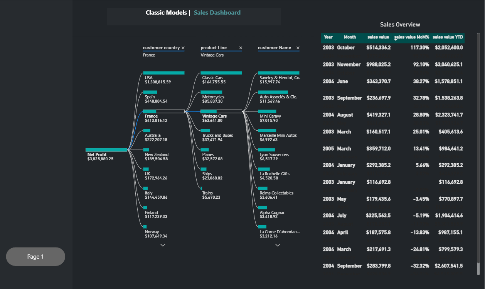
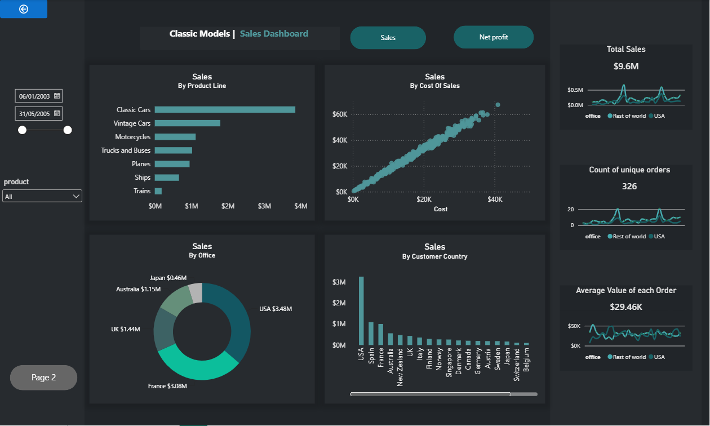

# Classic Models | Sales Dashboard (Power BI)

An interactive two-page Power BI dashboard analyzing sales performance for Classic Models, a fictional retailer of scale model vehicles.

The data is prepared in MySQL through a custom SQL view and then modeled and visualized in Power BI.

**Dataset:** [Classic Models on Kaggle](https://www.kaggle.com/datasets/pushkar365/classic-models)

---

## Dashboard Preview

### Page 1 – Sales Overview



### Page 2 – Sales Drill-down



---

## Key Metrics

**Period: January 2003 – May 2005**

| Metric | Value |
|---|---:|
| **Total Sales** | **$9.6M** |
| **Net Profit** | **$3.83M** |
| **Unique Orders** | **326** |
| **Average Order Value** | **$29.46K** |

---

## Dashboard Structure

### Page 1: Sales Overview

**KPI Cards with Trend Lines**

- Total Sales
- Count of Unique Orders
- Average Value of Each Order
- Comparison between USA and Rest of World offices

**Sales by Product Line – Bar Chart**

- Classic Cars lead in sales
- Followed by Vintage Cars and Motorcycles

**Sales by Cost of Sales – Scatter Plot**

- Shows the relationship between cost and sales value per order line

**Sales by Office – Donut Chart**

- USA: **$3.48M**
- France
- UK
- Australia
- Japan

**Sales by Customer Country – Column Chart**

- USA is the top market
- Followed by Spain and France

### Interactivity

- Date range slicer
- Product dropdown slicer
- Sales / Net Profit toggle button
- Page navigation buttons

---

### Page 2: Sales Drill-down

**Decomposition Tree**

Net Profit (**$3.83M**) can be broken down by:

**Customer Country → Product Line → Customer Name**

**Sales Overview Table**

Includes the following time-intelligence measures:

- Sales Value
- Sales Value MoM %
- Sales Value YTD

---

## Data Preparation (SQL)

The raw tables were joined into a single flat view that feeds Power BI.

The following tables were used:

- `orders`
- `orderdetails`
- `customers`
- `products`
- `employees`
- `offices`

The SQL view includes:

- Sales value per order line
- Cost of sales per order line
- Customer geography
- Office geography

The full SQL script is available at:

`sql/sales_data_for_power_bi.sql`

---

## Tools & Skills Demonstrated

### SQL (MySQL)

- Multi-table joins
- Aggregation
- Creating SQL views

### Power BI

- Data modeling
- DAX measures
- Month-over-month (MoM) analysis
- Year-to-date (YTD) analysis
- Bookmarks
- Slicers
- Drill-through navigation
- Decomposition Tree

### Visualization

- KPI Cards
- Bar Charts
- Column Charts
- Scatter Plots
- Donut Charts
- Decomposition Tree
- Dark-theme dashboard design

---

## Repository Structure

```text
├── README.md
├── ClassicModels_Dashboard.pbix
├── sql/
│   └── sales_data_for_power_bi.sql
└── images/
    ├── page1.png
    └── page2.png
```

---

## How to Use

1. Load the Classic Models dataset into MySQL.
2. Run the SQL script:

```text
sql/sales_data_for_power_bi.sql
```

3. Open `ClassicModels_Dashboard.pbix` in Power BI Desktop.
4. Update the data source connection to your local MySQL instance.
5. Refresh the data.

---

## Author

**Hadeel Taqi**

Information Systems Engineer | Data Analyst

**Skills:** SQL · Power BI · Python · Excel · Data Analysis
